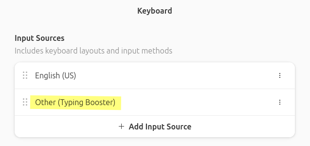
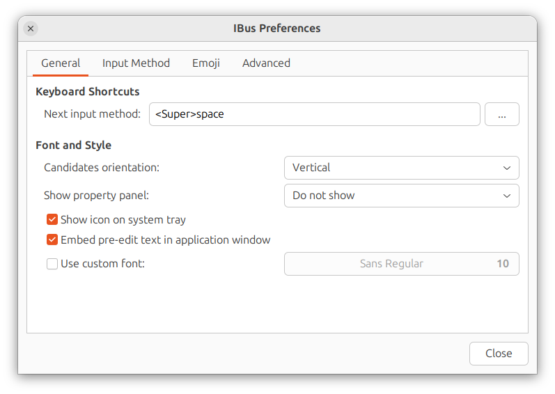
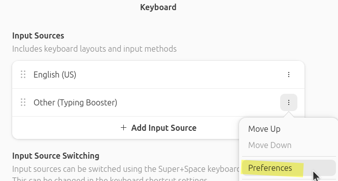
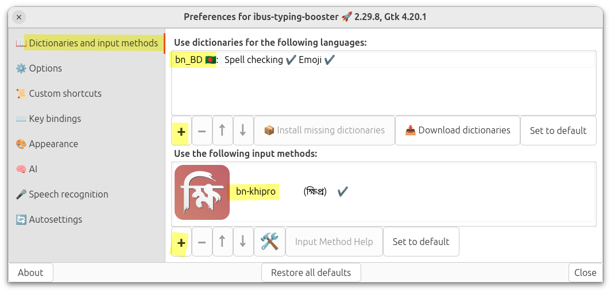
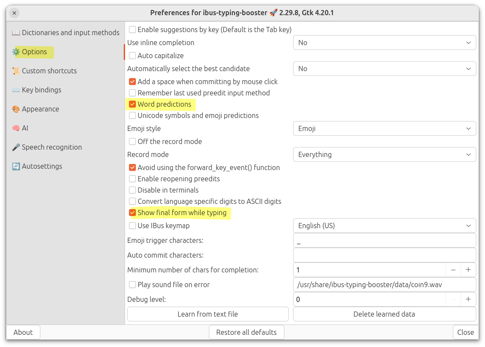
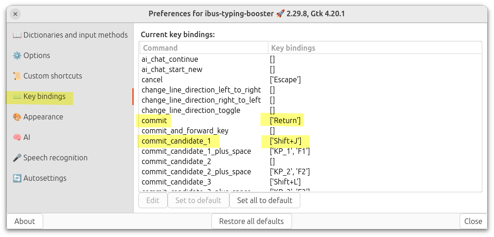
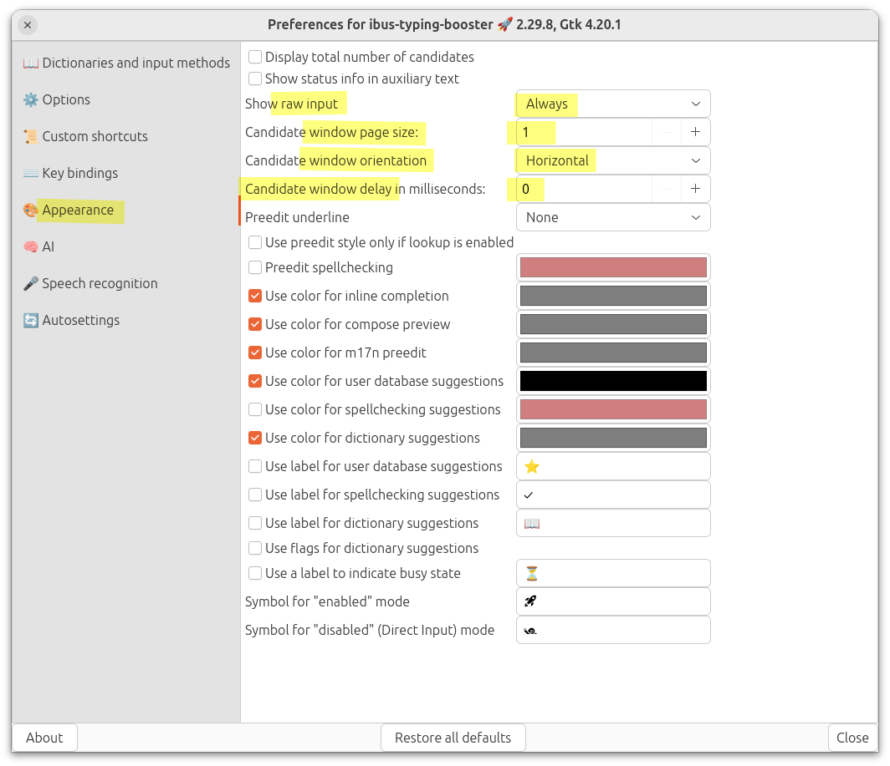

# লিনাক্স সিস্টেমে

লিনাক্স সিস্টেমে khipro-m17n দুই উপায়ে ব্যবহার করা যায়:

1. ibus-m17n দিয়ে। এক্ষেত্রে [টাইপিং বুস্টারও](https://mike-fabian.github.io/ibus-typing-booster/) ইনস্টল করা যাবে (টাইপিং বুস্টার একটি ইন্টেলিজেন্ট টাইপিং অ্যাসিস্ট্যান্ট। যেটাতে প্রিভিউ, সাজেশন, ও আরো বিভিন্ন ফিচার আছে)
2. fcitx5-m17n দিয়ে। fcitx \-এ আপাতত টাইপিং বুস্টার ব্যবহার করা যাচ্ছে না।

## ক্ষিপ্র m17n ইনস্টল করা

1. ক্ষিপ্র ইনস্টল করার আগে আইবাস ব্যবহারকারীরা `ibus-m17n` ইনস্টল করবেন এবং fcitx ব্যবহারকারীরা `fcitx5-m17n` ইনস্টল করবেন। আপনি যদি না জানেন এগুলো কী তবে আপনি অবশ্যই ibus চালাচ্ছেন; তাই `ibus-m17n` ইনস্টল করে নিন।
2. উবুন্টু, লিনাক্স মিন্ট এবং আরো কিছু ডিস্ট্রোতে বাংলার language pack আলাদা ভাবে ইনস্টল করতে হয়। Ubuntu-র ক্ষেত্রে “`Language Support`” অ্যাপটি ওপেন করে সেখান থেকে বাংলার জন্য ল্যাংগুয়েজ সাপোর্ট ইনস্টল করে নিন।  
   বাংলার জন্য ল্যাংগুয়েজ সাপোর্ট ইনস্টল করলেই বেশ কিছু ডিস্ট্রোতে `ibus-m17n` অটো ইনস্টল হয়ে যায়।  
   ল্যাংগুয়েজ সাপোর্টের মাধ্যমে বাংলার সাপোর্ট এবং `ibus-m17n` দুটোই ইনস্টল থাকাটা জরুরি। দুটোই ইনস্টল করা আছে কিনা নিশ্চিত করুন।
3. _(এই ধাপটি ঐচ্ছিক হলেও খুবই গুরুত্বপূর্ণ)_ এরপর [টাইপিং বুস্টার](https://mike-fabian.github.io/ibus-typing-booster/) ইনস্টল করে নিন। উবুন্টুতে `sudo apt install ibus-typing-booster` কমান্ড দিতে হবে। Fedora \-তে প্রি-ইনস্টল করা থাকার কথা। আপনি যদি fcitx ব্যবহারকারী হন তাহলে টাইপিং বুস্টার ব্যবহার করতে পারবেন না।
4. এরপরের কাজ, [khipro-m17n এর গিটহাব রিপোজিটরি](https://github.com/rank-coder/khipro-m17n) থেকে `bn-khipro.mim` ফাইলটি সিস্টেমের সঠিক জায়গায় রেখে দিতে হবে। এই কাজটি সহজে করতে নিচের কমান্ডটি টার্মিনালে রান করুন:
   ```bash
   sudo bash -c "$(curl -fsSL https://raw.githubusercontent.com/rank-coder/khipro-m17n/main/installer)"
   ```
   আপনার যদি আপনার কম্পিউটারে অ্যাডমিন অ্যাকসেস না থাকে তাহলে `sudo` কমান্ড কাজ করবে না। সেক্ষেত্রে `sudo` বাদ দিয়ে উপরের কমান্ডটি রান করুন। এক্ষেত্রে কেবল আপনার ইউজার অ্যাকাউন্টের জন্য ক্ষিপ্র ইনস্টল হবে।
5. এরপরে কম্পিউটার log out করে আবার log in করুন।
6. _(এই ধাপটি ঐচ্ছিক হলেও গুরুত্বপূর্ণ)_ এরপর টাইপিং বুস্টার কনফিগারেশনের পালা। টাইপিং বুস্টার ব্যবহারের সেরা অভিজ্ঞতা পাওয়ার জন্য [টাইপিং বুস্টারের কনফিগারেশন সংক্রান্ত সকল নির্দেশনা ও টিপস](/installation/#%E0%A6%9F%E0%A6%87%E0%A6%AA-%E0%A6%AC%E0%A6%B8%E0%A6%9F%E0%A6%B0-%E0%A6%95%E0%A6%A8%E0%A6%AB%E0%A6%97%E0%A6%B0-%E0%A6%95%E0%A6%B0) নিচে সংযুক্ত করা হয়েছে।
7. যারা টাইপিং বুস্টার ব্যতীত ক্ষিপ্র ব্যবহার করবেন তারা ক্ষিপ্র ইনস্টল করার পরে আপনার সিস্টেমের সেটিংস থেকে khipro-m17n -কে ইনপুট সোর্স হিসেবে অ্যাড করে নিন।  
আর যারা টাইপিং বুস্টারের মাধ্যমে ক্ষিপ্র ব্যবহার করবেন তারা টাইপিং বুস্টারকে ইনপুট সোর্স হিসেবে অ্যাড করুন।  
তারপরে সিস্টেমের ইনপুট মেথড কিংবা কিবোর্ড সংক্রান্ত সেটিংস থেকে টাইপিং বুস্টার সিলেক্ট করতে হবে। উবুন্টুতে নিচের ছবির মতো সেটিংস পাবেন Settings অ্যাপে। নিচের ছবি দ্রষ্টব্য...



> [!WARNING]  
আমরা টাইপিং বুস্টার ছাড়া ক্ষিপ্র ব্যবহার করা রেকমেন্ড করি না।  
তাছাড়া টাইপিং বুস্টার ইংরেজির জন্যও ইউস করা যায়।

যদি আপনার ডিস্ট্রোতে সিস্টেম সেটিংস থেকে আইবাসের সেটিংস কনফিগার করা না যায় তবে ibus-preferences থেকে কাজটি করতে হবে। অ্যাপ মেনু -তে `ibus preferences` নামে, অথবা টার্মিনালে `ibus-setup` কমান্ড দিয়ে লঞ্চ করতে পারবেন এবং সেখান থেকে টাইপিং বুস্টার কিংবা `khipro-m17n` সিলেক্ট করতে পারবেন। সেক্ষেত্রে নিচের ছবির মতো উইন্ডো আসবে।


### প্রি-রিলিস কিংবা টেস্টিং ভার্শন ইনস্টল করা

লিনাক্সে ক্ষিপ্র-র স্ট্যাবল রিলিস ছাড়াও প্রি-রিলিস ভার্শন ইনস্টল করে ট্রাই করতে পারবেন। এমনকি পুরাতন ভার্শনও ইনস্টল করতে পারবেন। সেটা করার জন্যও উপরের ইনস্টলেশন কমান্ডটি রান করে `Install stable release from the main branch? (Y/n): ` জিজ্ঞেস করা হলে `n` দিন। এবং ব্রাঞ্চের নাম জিজ্ঞেস করলে যেই ব্রাঞ্চ থেকে ইনস্টল করতে চান সেই ব্রাঞ্চের নাম দিন। এই উপায়ে টেস্টিং ব্রাঞ্চ থেকে কিংবা অন্য কোনো ব্রাঞ্চ থেকে কোনো ঝামেলা ছাড়াই ইনস্টল করা যাবে।


### আপডেট করা

আপডেট করাটা খুবই সোজা। [khipro-m17n এর রিলিস পেজে](https://github.com/rank-coder/khipro-m17n/releases) চেক করুন কোনো নতুন আপডেট এসেছে কিনা। নতুন আপডেট এসে থাকলে উপরে দেওয়া ইনস্টলেশনের কমান্ডটি দিয়েই আপডেট করা যাবে।

এরপর, কম্পিউটার লগআউট করে লগইন করুন।

### আনইনস্টল করা

আনইনস্টলেশন করতেও উপরের কমান্ড ব্যবহার করা যাবে। স্ক্রিপ্টটি রান হবার সময় আনইনস্টলেশন মোড সিলেক্ট করতে হবে।

---

# ওয়েব ব্রাউজারে

ক্ষিপ্র লেআউট ওয়েব ব্রাউজারে টেস্ট করা যায়। লিংক: https://khiproteam.github.io/khipro/quickstart/#libh-tipn-dm
ওখানে টাইপ করে আপনি যেকোনো জায়গায় কপি পেস্ট করতে পারবেন। এটা কেবল টেস্টিংয়ের জন্য বানানো হয়েছে।

---

# উইন্ডোজ সিস্টেমে

একাধিক উপায়ে ক্ষিপ্রকে উইন্ডোজে ব্যবহার করা যাচ্ছে:

1. কোডপত্রের জনপ্রিয় _বর্ণ কিবোর্ড_ এর নতুন দুটি ভার্শন `Borno Native` ও `Borno Drops`-এ ক্ষিপ্র লেআউট বিল্ট-ইন রয়েছে।
2. `NMS Kontho` অ্যাপ্লিকেশনের মাধ্যমে।

নিচে এগুলো সম্পর্কে বলছি...

## বর্ণ কিবোর্ডের মাধ্যমে

কোডপত্রের জনপ্রিয় কিবোর্ড _বর্ণ_ তে ক্ষিপ্র লেআউট বিল্ট-ইন থাকছে।

1. [কোডপত্রের ওয়েবসাইট](https://codepotro.com/borno/) থেকে বর্ণ কিবোর্ডের সর্বশেষ ভার্শনটি (Borno Native) ডাউনলোড করে ইনস্টল করুন।
2. অথবা ইনস্টল করা ছাড়াই বর্ণ কিবোর্ডের পোর্টেবল ভার্শন [Borno Drops](https://codepotro.com/borno-drops/) এর মাধ্যমে ব্যবহার করুন।

> [!WARNING]
বর্ণ কিবোর্ডে ক্ষিপ্র এক-দুই ভার্শন পিছনে থাকতে পারে। যেহেতু ক্ষিপ্র-কে প্রতিনিয়ত ইউজার ফিডব্যাক নিয়ে উন্নততর করা হচ্ছে।

## NMS Kontho কিবোর্ডের মাধ্যমে

NMS Kontho সফটওয়্যারের জন্য কমিউনিটির তৈরি একটি ক্ষিপ্র-ভিত্তিক লেআউট রয়েছে।  
[NMS Kontho সফটওয়্যারের লিংক](https://nabil-bot.github.io/Kontho/index.html)  
[Khipro NMS লেআউটের লিংক](https://github.com/KhiproKeyboard/khipro-nms)

> [!WARNING]
NMS Kontho -তে ক্ষিপ্র কয়েক ভার্শন পিছনে থাকতে পারে। যেহেতু ক্ষিপ্র-কে প্রতিনিয়ত ইউজার ফিডব্যাক নিয়ে উন্নততর করা হচ্ছে।
---

# অ্যান্ড্রয়েডে

অ্যান্ড্রয়েড অপারেটিং সিস্টেমে ক্ষিপ্র ব্যবহার করা যাচ্ছে নিচের উপায়গুলোয়:

## HeliBoard

হেলিবোর্ড একটি ওপেনসোর্স আন্ড্রয়েড কিবোর্ড অ্যাপ। আমাদের কমিউনিটির হাত ধরে ক্ষিপ্র লেআউট এই কিবোর্ডে যুক্ত হয়েছে। হেলিবোর্ডের `3.6-beta1` ও পরবর্তী সকল Beta ও Stable রিলিস থেকে ক্ষিপ্র লেআউট ব্যবহার করা যাবে। নিচের লিংক থেকে হেলিবোর্ড ডাউনলোড করতে পারবেন।

[হেলিবোর্ড গিটহাব রিলিস পেইজ](https://github.com/Helium314/HeliBoard/releases)  
[এফ-ড্রয়েডে হেলিবোর্ড](https://f-droid.org/packages/helium314.keyboard)

> [!CAUTION]  
হেলিবোর্ডের রিলিসে দুটি সমস্যা রয়েছে (Known Issues):  
১. শব্দের মাঝে এডিট করা যায়না, শেষে চলে যায়। এটা হেলিবোর্ড এর কম্বাইনার-এর সমস্যা। এটা অতিসত্বর ফিক্স করা হবে।  
২. স্পেস ছাড়া ব্যাকস্পেস চাপলে মাঝে মাঝে একাধিক কমিট হয়ে যায়, এটাও হেলিবোর্ড এর সমস্যা। এটা অতিসত্বর ফিক্স করা হবে।  
৩. এছাড়া হেলিবোর্ডের ক্ষিপ্র এক ভার্শন পিছনে থাকতে পারে। যেহেতু ক্ষিপ্র-কে প্রতিনিয়ত ইউজার ফিডব্যাক নিয়ে উন্নততর করা হচ্ছে।


> [!IMPORTANT]  
১. ক্ষিপ্র কিবোর্ডের টাচ স্ক্রিন আডাপ্টেশন সাজেশনে স্ল্যাশ-কে স্পেসবারের পাশে রাখার কথা বলা হলেও হেলিবোর্ডের ক্ষেত্রে তা করা সম্ভব হয়নি। একে সেমিকোলনের সঙ্গে পপআপ হিসেবে রাখা হয়েছে।  
২. ঈশ্বর চিহ্নের ম্যাপিংয়ে ডটের পরিবর্তে দাঁড়ির ব্যবহার করা হয়েছে। অর্থাৎ `।ff` \= `৺`

## Borno Android

বর্ণ অ্যান্ড্রয়েডের আসন্ন আপডেটে ক্ষিপ্র লেআউট পাওয়া যাবে। আপডেট এসেছে কিনা তা জানতে গুগল প্লে স্টোর থেকে বর্ণ অ্যান্ড্রয়েড ইনস্টল করে রাখতে পারেন।  
[বর্ণ অ্যান্ড্রয়েডের গুগল প্লে স্টোর লিংক](https://play.google.com/store/apps/details?id=com.codepotro.borno.keyboard&pcampaignid=web_share)

---

# টাইপিং বুস্টার কনফিগার করা

টাইপিং বুস্টার ইনস্টল করা হয়ে গেলে এরপর কম্পিউটার লগ আউট করে আবার লগ ইন করতে হবে।  
তারপরে সিস্টেমের ইনপুট মেথড কিংবা কিবোর্ড সংক্রান্ত সেটিংস থেকে টাইপিং বুস্টার সিলেক্ট করতে হবে। উবুন্টুতে নিচের ছবির মতো সেটিংস পাবেন Settings অ্যাপে। নিচের ছবি দ্রষ্টব্য...

  

যদি আপনার ডিস্ট্রোতে সেটিংস থেকে আইবাসের সেটিংস কনফিগার করা না যায় তবে ibus-preferences থেকে কাজটি করতে হবে। অ্যাপ মেনু -তে `ibus preferences` নামে, অথবা টার্মিনালে `ibus-setup` কমান্ড দিয়ে লঞ্চ করতে পারবেন এবং সেখান থেকে টাইপিং বুস্টার কিংবা `khipro-m17n` সিলেক্ট করতে পারবেন।

তারপরে সেখান থেকে টাইপিং বুস্টারের preferences কিংবা সেটিংসে যেতে হবে। নিচের ছবি দ্রষ্টব্য...

  

টাইপিং বুস্টারের সেটিংস ওপেন হলে প্রথমেই দেখা যাবে "Dictionaries & Input Methods" ট্যাব। সেখান থেকে বাংলার জন্য **একটা ডিকশনারি** সিলেক্ট করতে হবে। বাংলার জন্য তিনটা ডিকশনারি পাবেন; যেকোনো একটি সিলেক্ট করলেই হবে।  
এরপর টাইপিং বুস্টারের মধ্যেই **ইনপুট মেথড** হিসেবে ক্ষিপ্রকে সিলেক্ট করতে হবে এবং অন্যান্য ইনপুট মেথড রিমুভ করতে পারেন। নিচের ছবি দ্রষ্টব্য...

  

এরপরে "Options" ট্যাবে গিয়ে সেখান থেকে:
1. `Show final form while typing` এটা অবশ্যই চালু করে দিতে হবে।
2. `Word predictions`-ও চালু করে দিতে পারেন।

  

> [!IMPORTANT]  
 "Avoid using the forward_key_event() function" এটাতে টিকচিহ্ন ✓ দিতে হবে যদি টাইপিং বুস্টারে কমিট করার সময় হঠাৎ একা একা ইনসার্শন পয়েন্টার (insertion pointer) নড়ে যাওয়ার ইশুর সম্মুখীন হন। নাহলে দরকার নেই।

এরপরে "Keybindings" ট্যাবে যেতে হবে। সেখানে:
1. Commit এর জন্য Enter, 
2. Commit-candidate-1 এর জন্য কিবোর্ডের Shift+J সেট করুন। 
3. commit-candidate-1-plus-space এই কিবাইন্ডিংয়ের কোনো দরকার নেই। কারণ হলো বাংলার জন্য সাজেশন কমিট করার পর স্পেস যুক্ত হওয়াটা ভালো না। বাংলায় বিভক্তি, কিংবা দুই শব্দ জোড়া দিয়ে লিখতে হতে পারে।  
এডিট করা হলে কিছুটা নিচের ছবির মতো দাঁড়াবে:

  

প্রথম সাজেশনটাকে কমিট করার জন্য shift+J সেট করছি যাতে মূল কিবোর্ড থেকে হাত না সরিয়ে সাজেশন সিলেক্ট করা যায়।

এরপরে আমাদের কাজ "**Appearance**" ট্যাবে। এখানে:
1. `Show raw input` এটা অবশ্যই চালু রাখতে হবে। নতুবা আপনি কোন key-sequence এর জন্য ক্ষিপ্রতে কোন আউটপুট পাচ্ছেন সেটা দেখতে পাবেন না। আমি এখানে `Always` সেট করছি।
2. `Candidate window page size` এর মান `1` রাখছি। কারণ আমার মতে সাজেশন একটা থাকলেই যথেষ্ট। তবে আপনি বেশি রাখতে পারেন।
3. `Candidate window delay` এটা অবশ্যই `0` রাখবেন নতুবা ক্যান্ডিডেট উইন্ডো দেরিতে আসবে আর এতে আপনার টাইপিংও স্লো হতে পারে।
3. `Candidate window orientation` আমি `horizontal` রাখছি।

নিচের ছবি দ্রষ্টব্য...



কোনো প্রশ্ন থাকলে আমাদের সাথে যোগাযোগ করুন: https://khiproteam.github.io/khipro/#community
